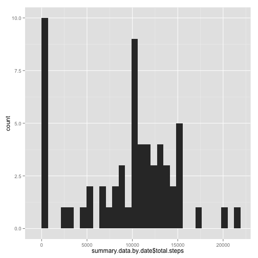
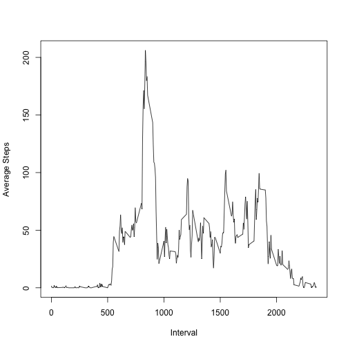
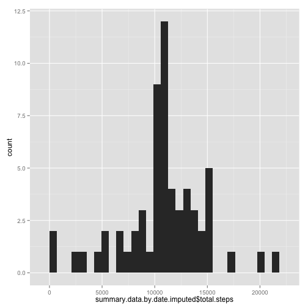
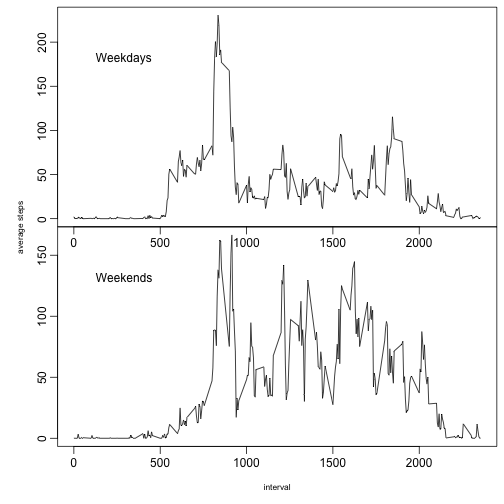

*******
  
## Loading and preprocessing the data


```r
  # load packages
  required.libraries <- c('ggplot2', 'dplyr', 'knitr', 'markdown')
  lapply(required.libraries, library, character.only=T)
```

```
## [[1]]
##  [1] "markdown"  "knitr"     "ggplot2"   "dplyr"     "stats"    
##  [6] "graphics"  "grDevices" "utils"     "datasets"  "methods"  
## [11] "base"     
## 
## [[2]]
##  [1] "markdown"  "knitr"     "ggplot2"   "dplyr"     "stats"    
##  [6] "graphics"  "grDevices" "utils"     "datasets"  "methods"  
## [11] "base"     
## 
## [[3]]
##  [1] "markdown"  "knitr"     "ggplot2"   "dplyr"     "stats"    
##  [6] "graphics"  "grDevices" "utils"     "datasets"  "methods"  
## [11] "base"     
## 
## [[4]]
##  [1] "markdown"  "knitr"     "ggplot2"   "dplyr"     "stats"    
##  [6] "graphics"  "grDevices" "utils"     "datasets"  "methods"  
## [11] "base"
```

```r
  # load data
  activity.file <- "activity" #without extension
  unzip(paste(activity.file, ".zip", sep=""))
  activity.data <- read.csv(paste(activity.file, ".csv", sep=""))

  # total steps by date
  activity.data.by.date <- group_by(activity.data, date)
  summary.data.by.date <- summarise(activity.data.by.date, total.steps=sum(steps, na.rm = TRUE))
```

*******
    
## What is mean total number of steps taken per day?
  

```r
  # plot total steps per day
  ggplot(data=summary.data.by.date, aes(summary.data.by.date$total.steps)) + geom_histogram()
```

```
## stat_bin: binwidth defaulted to range/30. Use 'binwidth = x' to adjust this.
```

 

```r
  # calculate mean and median steps
  mean.steps = mean(summary.data.by.date$total.steps)
  median.steps = median(summary.data.by.date$total.steps)
```
    
      
The mean steps taken per day is **9354.2295082**, and the median is **10395**.
     
*******

## What is the average daily activity pattern?
  

```r
  # group by interval
  activity.data.by.interval <- group_by(activity.data, interval)
  summary.data.by.interval <- summarise(activity.data.by.interval, average.steps=mean(steps, na.rm = TRUE))

  # plot average steps per interval
  plot(summary.data.by.interval$interval, summary.data.by.interval$average.steps, 
       ylab ="Average Steps", xlab="Interval", type="l")
```

 

```r
  #find max interval
  interval = which.max(summary.data.by.interval$average.steps)
  max.steps = summary.data.by.interval$interval[interval]
```
     
       
The interval with the maximum average steps is **104** with **835** steps on average.
 
*******
    
## Imputing missing values


```r
  # count na rows
  na.count <- sum(is.na(activity.data$steps))
```
    
    
There are **2304** records with NA steps recorded.      
    
   
Replace NA values for *steps* with average for that interval across the month (imputed value).

```r
  # copy data frame to new data frame
  activity.data.imputed <- activity.data
  
  # replace NA with imputed value using average for that interval across the month
  for(i in 1:nrow(activity.data.imputed)) {
    row <- activity.data.imputed[i,]
    if (is.na(row$steps)) { 
      newsteps <- summary.data.by.interval[summary.data.by.interval$interval == 
                                            row$interval,"average.steps"]
      activity.data.imputed[i,]$steps <- as.integer(newsteps)
    }
  }

  # total steps by date (with imputed values)
  activity.data.by.date.imputed <- group_by(activity.data.imputed, date)
  summary.data.by.date.imputed <- summarise(activity.data.by.date.imputed, total.steps=sum(steps))

  # plot total steps per day (with imputed values)
  ggplot(data=summary.data.by.date.imputed, aes(summary.data.by.date.imputed$total.steps)) + geom_histogram()
```

```
## stat_bin: binwidth defaulted to range/30. Use 'binwidth = x' to adjust this.
```

 

```r
  # calculate mean and median steps
  mean.steps.imputed = mean(summary.data.by.date.imputed$total.steps)
  median.steps.imputed = median(summary.data.by.date.imputed$total.steps)
```
  
  
When including imputed values, the mean steps taken per day is **1.074977 &times; 10<sup>4</sup>**, and the median is **10641**.  Both the mean and median are **higher** when the imputed values are included.

*******
    
## Are there differences in activity patterns between weekdays and weekends?

*ASSUMPTION:* Using the activity data that *includes* the imputed data from the previous question to complete this part of the assignment.


```r
  # Add column and label for weekdays
  activity.data.imputed$day.type[which(weekdays(as.Date(activity.data.imputed$date)) 
    %in% c("Monday", "Tuesday", "Wednesday", "Thursday", "Friday"))] <- "weekday" 
  
  # Label weekend days
  activity.data.imputed$day.type[which(weekdays(as.Date(activity.data.imputed$date)) 
    %in% c("Saturday", "Sunday"))] <- "weekend" 

  # group weeekdays by interval
  activity.data.by.interval.weekdays <- group_by(filter(activity.data.imputed, day.type == "weekday"), interval)
  summary.data.by.interval.weekdays <- summarise(activity.data.by.interval.weekdays, average.steps=mean(steps))

  # group weekend days by interval
  activity.data.by.interval.weekend <- group_by(filter(activity.data.imputed, day.type == "weekend"), interval)
  summary.data.by.interval.weekend <- summarise(activity.data.by.interval.weekend, average.steps=mean(steps))

  # set plot params
  par(mfrow = c(2,1), mar = c(0,0,0,0), mgp = c(2,0.6,0), oma = c(4,4,0.5,0.5))

  # plot average steps per interval (weekday)
  plot(summary.data.by.interval.weekdays$interval, summary.data.by.interval.weekdays$average.steps, ylab ="Average Steps", xlab="Interval", type="l")
  mtext("Weekdays", side = 3, line = -4, adj = 0.1)

  # plot average steps per interval (weekend)
  plot(summary.data.by.interval.weekend$interval, summary.data.by.interval.weekend$average.steps, ylab ="Average Steps", xlab="Interval", type="l")
  mtext("Weekends", side = 3, line = -4, adj = 0.1)

  mtext("interval", side = 1, outer = TRUE, cex = 0.7, line = 2.2)
  mtext("average steps", side = 2, outer = TRUE, cex = 0.7, line = 2.2)
```

 

